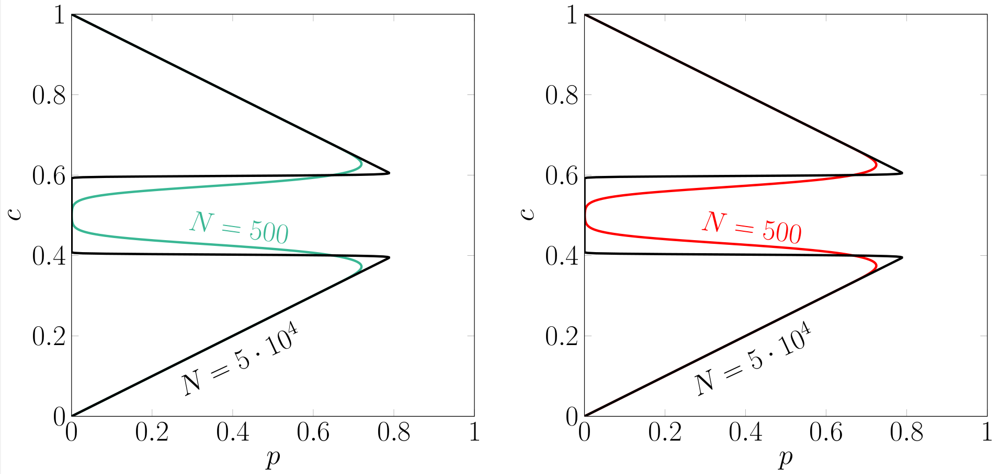

# Threshold model normal approximation

Plot for threshold model with its approximation by normal distribution. You can get more info about this model in my publication [Homogeneous Symmetrical Threshold Model with Nonconformity: Independence versus Anticonformity](https://www.hindawi.com/journals/complexity/2019/5150825/) written with Katarzyna Sznajd-Weron. 

Both versions of the model can be approximate by normal distribution. In the published version we used binomial distribution to calculate $B_{c}$ and $B_{1-c}$ coefficient. But you are able to do it also with following approximation:
$$B_{c} \approx \frac{1}{2} - \frac{1}{2} \text{erf} \left(\frac{\sqrt{N}(r-c)}{\sqrt{2c(1-c)}}\right).$$
Result is presented on the plot:
